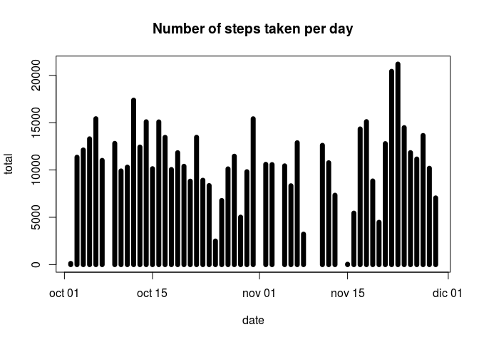
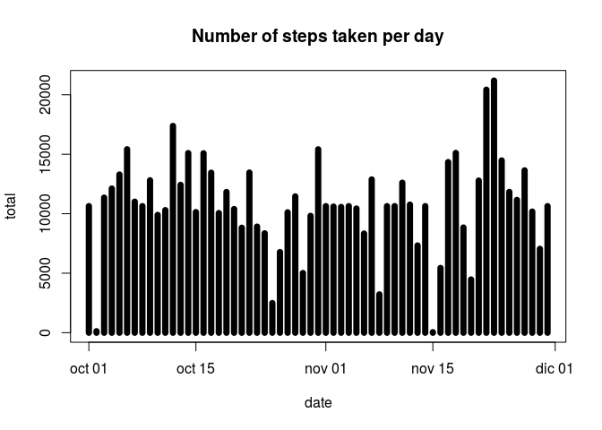
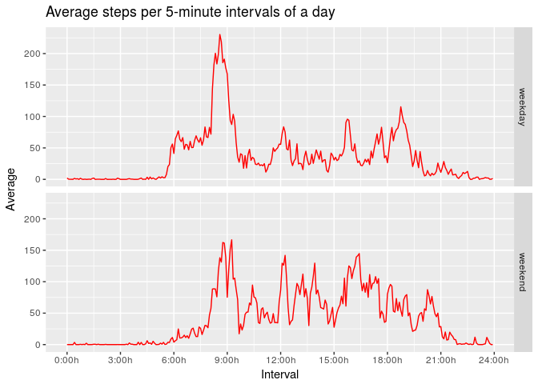

## Loading and preprocessing the data

First at all we need to unzip the activity.zip file and load the data:


```r
unzip ("activity.zip")
dataset <- read.csv ("activity.csv")
```

Now we change the date format from a factor to a date class in R with the *lubridate* package, and we convert the interval code to minuts (all of this with the *dplyr* package to make an easy-to-read code):


```r
library (lubridate)
library (dplyr)
dataset <- mutate (dataset,
                   date = ymd (date),
                   interval = floor (interval / 100) * 60 + interval %% 100)
```

## What is mean total number of steps taken per day?

To calculate the total number of steps taken per day we group the data by the date column:


```r
steps_per_day <- dataset %>%
                 group_by (date) %>%
                 summarize(total = sum (steps, na.rm = TRUE))
```

This is shown in the next histogram:


```r
plot (steps_per_day, type = "h", main = "Number of steps taken per day")
```

<!-- -->

Finally, to calculate both the mean and the median of the total number of steps taken per day, we use the corresponding functions:


```r
mean_steps <- mean (steps_per_day$total)
median_steps <- median (steps_per_day$total)
```

So there is a mean of 9354.2295082 steps per day, with a median of 10395 steps.

## What is the average daily activity pattern?

The next plot show us the average steps taken by every 5-minute interval in a day:


```r
average_interval <- dataset %>%
                    group_by (interval) %>%
                    summarize(average = mean (steps, na.rm = TRUE))
with (average_interval,
      plot (interval, average, type = "l", col = "red",
            xlab = "Interval (minuts)", ylab = "Average steps",
            main = "Average steps per 5-minute interval of a day"))
```

<!-- -->

We can see from the last graphic that the maximum average number of steps by 5-minute interval is, more or less, on minute 500 (08:20h). But to be more accurate:


```r
max <- with (average_interval, interval [which (average == max (average))])
time <- paste0 (floor (max / 60), ":", max - floor (max / 60) * 60, "h")
```

So the maximum average number of steps by 5-minute interval is on minute 515 (8:35h).

## Inputing missing values

First at all, we can see how many missing values the data contain on the following table:


```r
library (xtable)
NA_count <- as.integer (colSums (is.na (dataset)))
NA_table <- data.frame ()
NA_table <- rbind (NA_table, NA_count)
names (NA_table) <- names (dataset)
row.names (NA_table) <- "Total NA"
print (xtable (NA_table), type = "html")
```

<!-- html table generated in R 3.4.3 by xtable 1.8-2 package -->
<!-- Wed Feb 14 18:21:39 2018 -->
<table border=1>
<tr> <th>  </th> <th> steps </th> <th> date </th> <th> interval </th>  </tr>
  <tr> <td align="right"> Total NA </td> <td align="right"> 2304 </td> <td align="right">   0 </td> <td align="right">   0 </td> </tr>
   </table>

In order to input missing values, we are going to use the average number of steps in every 5-minute interval (recall that the interval column of the "dataset" data frame is the same as the first column of "average_interval" data frame, but repeated, so that's why we can use the module operator **%%**):


```r
full_dataset <- dataset
for (i in 1:nrow (full_dataset))
  if (is.na (full_dataset$steps [i]))
  {
    index <- (i-1) %% nrow (average_interval) + 1
    full_dataset$steps [i] <- round (average_interval$average [index], digits = 0)
  }
```

We are going to see now how the histogram plotted above changes with the missing values filled in:


```r
full_steps_per_day <- full_dataset %>%
                      group_by (date) %>%
                      summarize(total = sum (steps, na.rm = TRUE))
plot (full_steps_per_day, type = "h", main = "Number of steps taken per day")
```

<!-- -->

We can see that some days that had no steps registered, now have, but in general, the shape of the histogram doesn't change so much.

And for the mean and the median of the total number of steps taken per day:


```r
full_mean_steps <- mean (full_steps_per_day$total)
full_median_steps <- median (full_steps_per_day$total)
```

This is, now the mean is 1.0765639\times 10^{4} steps per day, and the median is 1.0762\times 10^{4} steps per day. Both numbers have increased after inputting missing values. This is not strange: now the total steps per day is equal to the total steps per day before inputting missing values plus all the numbers we have added instead of missing values.

## Are there differences in activity patterns between weekdays and weekends?

We are going to separate the weekdays from the weekends, so we need another variable in our dataset:


```r
full_dataset <- mutate (full_dataset,
                        type_day = ifelse (wday (date) == 1 | wday (date) == 7,
                                           "weekend", "weekday"))
full_dataset$type_day <- as.factor (full_dataset$type_day)
```

Finally, the next graphic show us a comparison between the average number of steps taken by every 5-minute interval in a weekday and the same in a weekend:


```r
full_average_interval <- full_dataset %>%
                         group_by (type_day, interval) %>%
                         summarize(average = mean (steps, na.rm = TRUE))
library (ggplot2)
ggplot (full_average_interval, aes (interval, average)) +
  geom_line (col="red") + facet_grid (type_day ~ .)
```

<!-- -->
